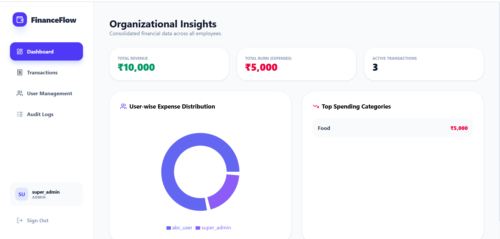
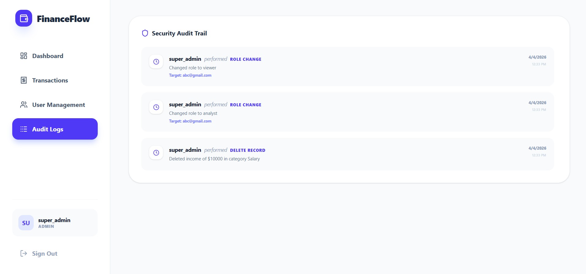
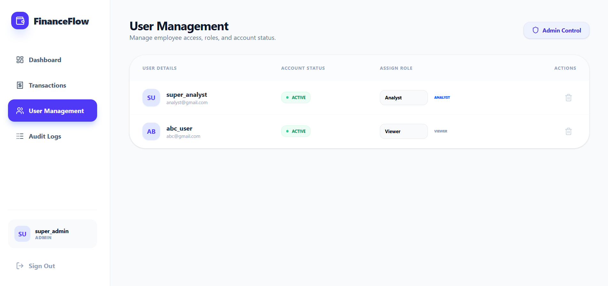
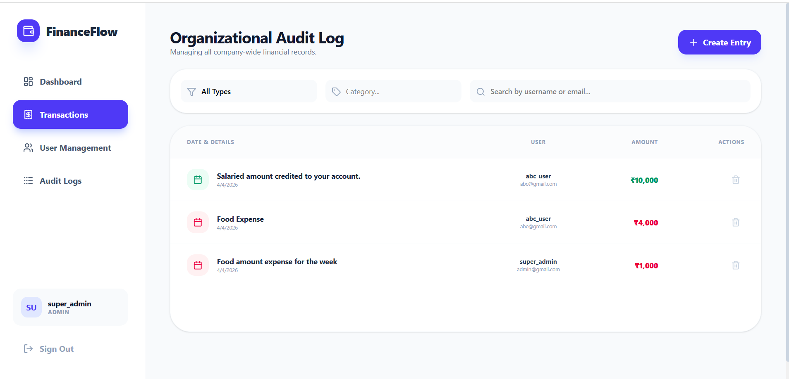

# 💰 FinanceFlow: Enterprise Financial Audit System

FinanceFlow is a full-stack MERN application designed for organizational financial oversight. It features a robust **Role-Based Access Control (RBAC)** system with three distinct tiers: Admin, Analyst, and Viewer.

## 🚀 Live Demo
- **Frontend:** https://finance-flow-six-beta.vercel.app/

---

## 🛠️ Tech Stack
- **Frontend:** React.js, Tailwind CSS, Lucide Icons, Recharts (Data Viz), Zustand (State Management)
- **Backend:** Node.js, Express.js
- **Database:** MongoDB Atlas (Mongoose ODM)
- **Security:** JWT Authentication, Bcrypt Password Hashing

---

## 🔐 Role-Based Access Control (RBAC)

| Feature | Admin | Analyst | Viewer |
| :--- | :---: | :---: | :---: |
| View Personal Dashboard | ✅ | ✅ | ✅ |
| View Global Analytics | ✅ | ✅ | ❌ |
| Create Transactions (Self) | ✅ | ❌ | ❌ |
| Create Transactions (Others) | ✅ | ❌ | ❌ |
| Delete Transactions | ✅ | ❌ | ❌ |
| Manage Users (Roles/Status) | ✅ | ❌ | ❌ |
| View Security Audit Logs | ✅ | ❌ | ❌ |

---

## Sample Credentials To See The Financial Dashboard

| Role | Email | Password | Username |
| :--- | :---: | :---: | :---: |
| Admin | admin@gmail.com | admin123 | super_admin |
| Analyst | analyst@gmail.com | hello123 | super_analyst |


---

## ✨ Key Features
- **Smart Dashboard:** Context-aware UI that switches between "Global Overview" and "Personal View" based on login.
- **Security Audit Trail:** A dedicated ledger that logs every critical administrative action (Role changes, deletions, etc.).
- **Visual Analytics:** Real-time Pie and Bar charts showing "Top Spenders" and "Category Distribution" using MongoDB Aggregation.
- **Account Kill-Switch:** Admins can instantly deactivate/activate any user account.

---

## 📸 Screenshots

### 🖥️ Admin Dashboard (Global Overview)
*Monitor organization-wide spending and top contributors at a glance.*



### 🛡️ Security Audit Trail
*Detailed logs of administrative actions for complete transparency and accountability.*


### ⚙️Admin User Management
*Admin-only interface to manage user roles and account statuses.*


### ⚙️Admin Transaction Page
*Admin-only interface to manage user roles and account statuses.*


---

## ⚙️ Installation & Setup

### 1. Clone the repository
```bash
git clone [https://github.com/your-username/FinanceFlow.git](https://github.com/your-username/FinanceFlow.git)
cd FinanceFlow